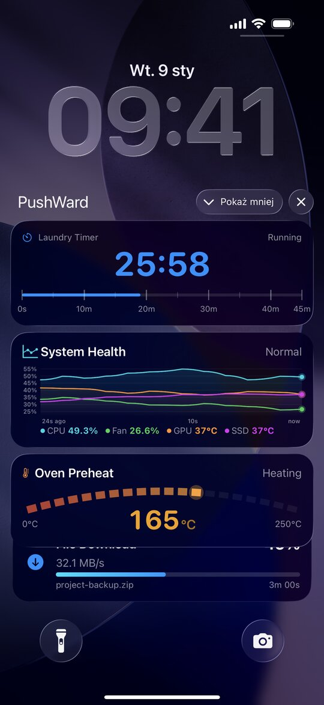
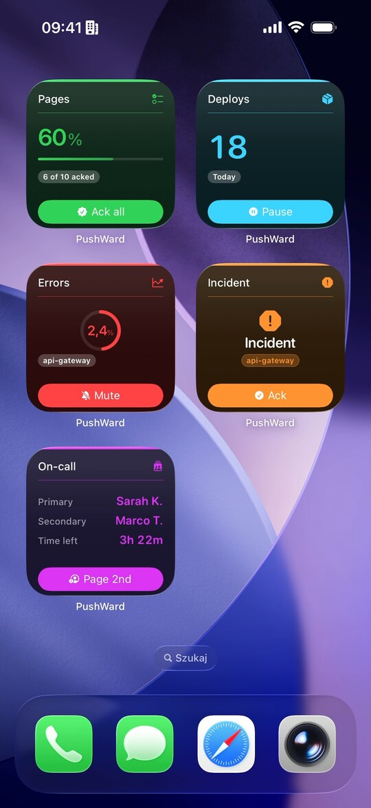
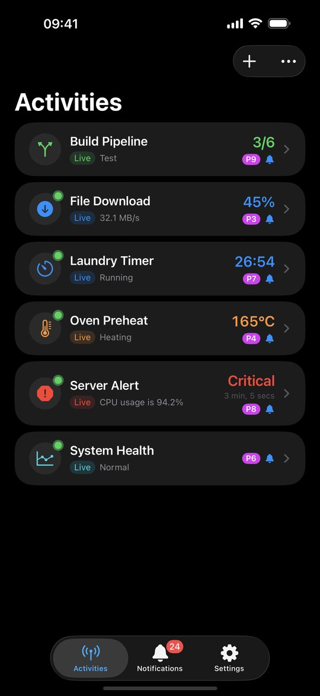
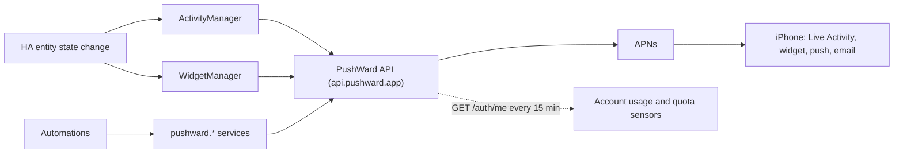

[](https://hacs.xyz)
[](https://pushward.app)
[](https://apps.apple.com/app/id6759689999)

# PushWard for Home Assistant

[](https://github.com/mac-lucky/pushward-hass/actions/workflows/ci.yml)
[](https://github.com/mac-lucky/pushward-hass/releases)
[](LICENSE)

Mirror Home Assistant entities onto iPhone via [PushWard](https://pushward.app), as **Live Activities** (Dynamic Island + Lock Screen) and **Home/Lock Screen widgets**, plus account usage sensors and services to send push notifications, transactional email, and activity/widget updates from your automations.

> **New to PushWard?** Learn more at **[pushward.app](https://pushward.app)**. The iOS app is on the **[App Store](https://apps.apple.com/app/id6759689999)**; you control everything from this integration and your automations.

## What it looks like

The entity you track shows up on the phone as a Live Activity, a Home/Lock Screen widget, or both.

<p align="center">
  
  
  
</p>

<p align="center"><em>Lock Screen Live Activities &nbsp;|&nbsp; Home Screen widgets &nbsp;|&nbsp; the in-app activity list. More examples at <a href="https://pushward.app">pushward.app</a>.</em></p>

## Contents

[What it looks like](#what-it-looks-like) · [How it works](#how-it-works) · [Features](#features) · [Prerequisites](#prerequisites) · [Installation](#installation) · [Configuration](#configuration) · [Account sensors](#account-sensors) · [Services](#services) · [Domain Defaults](#domain-defaults) · [Contributing](#contributing) · [Support](#support) · [Translations](#translations) · [Development](#development) · [CI/CD & Releases](#cicd--releases) · [Server compatibility](#server-compatibility) · [Troubleshooting](#troubleshooting) · [Requirements & License](#requirements--license)

## How it works

The integration watches HA entity state changes and surfaces them on your iPhone two independent ways, while polling your account's own usage counters for sensors:



- **Live Activities**: when an entity enters a configured *start* state (e.g. the washer turns on), a Live Activity appears; on an *end* state it dismisses with a two-phase completion animation. Each tracked entity is a `tracked_entity` subentry.
- **Widgets**: an entity (or several, for `stat_list`) is bound to a server-rendered Home/Lock Screen widget that re-renders on state change or on a poll interval. Each widget is a `tracked_widget` subentry.

The two surfaces are independent (separate config, managers, and caches) and share only the API client and icon/color resolution.

## Features

- **Track any HA entity** as a PushWard Live Activity (Dynamic Island + Lock Screen)
- **9 activity templates**: generic, countdown, alert, steps, gauge, timeline, board, log, media
- **10 widget templates**: value, progress, gauge, status, stat_list, trend, countdown, battery, schedule, flow
- **Two widget trigger modes**: `event` (state-change) or `poll` (10-3600 s interval), plus an optional
  staleness heartbeat that keeps a rarely-changing widget from greying out
- **Account usage sensors**: notifications, Live Activity updates, widget updates, and emails consumed vs. plan limits, plus subscription tier
- **Template auto-suggestion** picks the best activity template from entity domain and device class
- **14 domain defaults**: pre-filled start/end states and a default icon per HA domain
- **Companion source entities**: read remaining time, progress, value, etc. from a *separate* entity
- **Two-phase end** shows a completion state (green checkmark) before dismissing
- **Live-progress ETA** fills the progress bar smoothly and counts down to a finish time (generic + steps)
- **Activity artwork** beside the icon (generic + steps + media), with an inline ThumbHash computed
  here so a picture that only Home Assistant can reach still renders on the phone
- **Tracked media players** as a player card: cover art read off the entity, a scrubber that ticks
  on the device, and transport buttons that call back into Home Assistant
- **Throttled updates** with content deduplication
- **6-level icon fallback**: attribute -> config -> entity -> registry -> device class -> domain default
- **Color support**: RGB, HSV, XY, Kelvin, named colors
- **TTL controls**: auto-delete after end, auto-end on stale activity, auto-dismiss from the Lock Screen
- **Services** for the whole surface: create/update/end/delete activities (with a per-template update action), send notifications, send email, refresh/delete widgets, generate a ThumbHash

## Prerequisites

- **Home Assistant 2025.7.0** or newer
- A **PushWard account** with an **integration key** (`hlk_` prefix), created in the PushWard iOS app under **Settings > Integration Keys** (recommended scope `ha-*`)
  - The key needs the **`widgets`** permission to publish widgets
  - The key needs the **`emails`** capability *and* a verified recipient to use `send_email`
- The **[PushWard iOS app](https://pushward.app)** installed on the iPhone that will display the Live Activities / widgets

## Installation

### HACS (recommended)

[](https://my.home-assistant.io/redirect/hacs_repository/?owner=mac-lucky&repository=pushward-hass&category=integration)

PushWard is in the **default HACS store** - no custom repository needed. The button above opens it
directly in HACS; then download and restart. Or do it manually:

1. Open **HACS** in Home Assistant
2. Search for **PushWard**
3. Open it and click **Download**
4. **Restart Home Assistant**

### Manual

Copy the `custom_components/pushward` directory into your Home Assistant `config/custom_components/` folder and restart Home Assistant.

## Configuration

Setup is UI-driven (config flow). The **only** value you enter is your integration key; the server URL is fixed to `https://api.pushward.app` and is not user-editable.

[](https://my.home-assistant.io/redirect/config_flow_start/?domain=pushward)

1. Go to **Settings > Devices & Services > Add Integration**
2. Search for **PushWard**
3. Paste your **integration key** (validated against `GET /auth/me`)

Once the entry exists, add tracked entities and widgets through the integration's **Configure** / **Add tracked entity** / **Add tracked widget** subentry flows. The key can be replaced later via **Reconfigure**, and the integration auto-prompts for reauth if the key becomes invalid.

| Setting | Required | Default | Description |
|---------|:--------:|---------|-------------|
| Integration key | Yes | - | PushWard key (`hlk_` prefix). Stored on the config entry; validated on setup. |
| Server URL | No | `https://api.pushward.app` | Fixed by the integration; not shown in the UI. |

Every field label and its help text is shown live in the Home Assistant config-flow UI, so the tables below are a reference, not something you need to read before setting up.

### Add a tracked entity (Live Activity)

A two-step flow. **Step 1** picks the entity and a template (a better template is auto-suggested from the entity's domain/device class):

| Template | Use case |
|----------|----------|
| `generic` | Flexible: progress bar, subtitle, icon |
| `countdown` | Timer with remaining time and end date |
| `alert` | Severity-based notification (critical/warning/info) |
| `steps` | Multi-step process (e.g. build stages) |
| `gauge` | Numeric value with a range (e.g. temperature, battery) |
| `timeline` | Sparkline chart, up to 10 named series from attributes or separate entities |
| `board` | 1-4 tiles, each showing a value from a **separate** entity |
| `log` | Newest-first list of log lines (up to 20), one per state change |
| `media` | Player card for a `media_player`: cover art, a ticking scrubber, transport buttons |

**Step 2** configures the details (fields vary by template).

<details>
<summary><b>All Step 2 fields</b></summary>

| Field | Description |
|-------|-------------|
| Slug | Unique ID, max 128 chars (auto-generated from entity if blank) |
| Activity Name | Display name on iPhone |
| Icon / Icon Attribute | Static MDI/SF Symbol, or an entity attribute for a dynamic icon |
| Priority | 0-10 (default: 1) |
| Start / End States | States that trigger start or end |
| Update Interval | Min seconds between updates (default: 5) |
| Progress Entity / Attribute | 0-100 progress, optionally from a separate entity |
| Live Progress ETA | Fill the progress bar smoothly and count down an ETA to the finish time, using the remaining-time source (generic/steps templates; on steps it fills the current step) |
| Image URL / Shape / ThumbHash | Artwork beside the icon (generic/steps/media templates) - see [Activity images](#activity-images). On a media player, leave it empty and the cover art fills in |
| Remaining Time Entity / Attribute | Seconds remaining (countdown), with smart time parsing |
| Total Steps / Current Step Entity / Attribute | Steps tracking, optionally from a separate entity |
| Step Details | One row per step: label, row height (1-10), relative width, and color (steps template) |
| Severity | critical, warning, or info (alert template) |
| Value Entity / Attribute | Numeric value (gauge/timeline), optionally from a separate entity |
| Min / Max Value | Gauge range bounds (default: 0-100) |
| Unit | Display unit (e.g. °C, %) |
| Series | Rows mapping a tracked-entity attribute to a series label (multi-series timeline) |
| Series Entities | Rows binding a separate entity as a timeline line (entity, optional attribute and label), max 10 total |
| Primary Series | Label of the series shown as the headline value and used for the compact high/low range; empty = the tracked entity's own series (or the first configured one) |
| Per-Series Units | Rows mapping a series label to its unit (timeline template) |
| Scale / Decimal Places / Smooth Lines / Thresholds | Timeline sparkline options (Thresholds is a row table: value, optional color, optional label) |
| Back-History Period | Minutes of history to seed the sparkline on start (0-14400, up to 10 days; numeric sensors pull from the recorder, bounded by its retention). Points are downsampled evenly to keep the full span. |
| Board Tiles | Rows binding a separate entity to a tile (label, entity, attribute, unit, icon, color, URL), max 4 (board template) |
| Log Columns | Rows adding extra values to each log line (label, entity, attribute, unit), max 6 (log template) |
| Log Level Attribute | Attribute supplying each line's `info`/`warn`/`error` level (log template) |
| Transport Buttons | Show previous/play-pause/next/stop/volume on the card, filtered to what the player supports (media template) |
| Favorite Script | Script the heart button runs; hidden when empty (media template) |
| Subtitle Entity / Attribute | Subtitle text, optionally from a separate entity |
| State Labels | Rows giving custom display text per state (a state and its label, e.g. `on` shows `Running`) |
| Completion Message | Text shown at end (default: "Complete") |
| Accent / Background / Text Color (+ Attribute) | Static hex / named color, or an entity attribute |
| URL / Secondary URL | Deep-link URLs, http/https (steps/alert templates) |
| Ended TTL / Stale TTL / Dismissal TTL | Auto-delete-after-end / auto-end-after-idle (1-2592000 s) / auto-dismiss the ended activity from the Lock Screen (0-14400 s) |

Board tiles, stat rows, series entities, thresholds, log columns, state labels, the timeline series and per-series units maps, and the per-step details are all edited as row tables in the UI (add a row per entry). Stored configs and non-form callers keep working: the older comma-separated string forms for these fields are still accepted on input.

</details>

#### Reading values from separate entities

By default every value (remaining time, progress, subtitle, gauge value, current step, fired-at) is read from the **tracked entity**, its state or one of its attributes. Many appliances expose these as **separate entities** (e.g. an LG washer has one sensor for the program state and another for remaining time). For each value you can set an optional **source entity**:

- **Source entity empty** -> read from the tracked entity (default).
- **Source entity set, attribute empty** -> read that entity's **state**.
- **Source entity set, attribute set** -> read that **attribute** of the source entity.

**Smart time parsing**: the remaining-time source accepts a `timestamp`/finish-time sensor (anchors the end date directly, no drift), a `duration` sensor with a unit (`s`/`min`/`h`/`d`), an `H:MM:SS`/`MM:SS` string, or a plain number of seconds.

<details>
<summary><b>Multi-entity timeline series</b></summary>

A **timeline** can plot up to **10 named series** on one chart, each its own line, color, and unit. There are two ways to supply them, and they combine:

- **Series** is a row table, one row per attribute of the tracked entity, mapping the attribute to a series label.
- **Series Entities** is a row table that binds *separate* entities as lines, so values from unrelated sensors share one chart (a PM2.5 sensor per room, solar arrays, etc.). Each row takes an **entity** (required; its state, or an **attribute** you name) and an optional **label**. Left off, the label defaults to the entity's friendly name (with the attribute name appended for attribute sources so two attributes of one entity stay distinct). Labels are frozen when you save (the server merges series by label), truncated to 32 chars, and de-duplicated with a numeric suffix.

Each series entity is tracked as a companion, so a change to any one re-samples the chart while the anchor entity owns start/end. Units auto-default from each state-sourced entity's `unit_of_measurement`; the **Per-Series Units** table (a series label and its unit per row) overrides them. Numeric attributes in the 0-255 range (e.g. `brightness`) are rescaled to 0-100. The 10-line cap covers Series and Series Entities combined; the server and iOS app already render multi-series timelines, so this is a Home Assistant configuration option only.

</details>

<details>
<summary><b>Timeline sparkline backfill</b></summary>

**Back-History Period** seeds the sparkline when the activity starts. What can be seeded depends on where each series reads its value:

- **State-sourced series** (a plain numeric sensor, a value entity, or a series entity read as a state) backfill from Home Assistant's recorder in one batched query, so they fill in immediately on start.
- **Attribute-based series** (Series attribute maps, a value attribute, or a series entity read as an attribute) cannot use the recorder: Home Assistant 2024.8 [removed most attributes from the recorder](https://github.com/home-assistant/core/issues/123028). These fill only from samples the integration collects live while it runs.

For attribute-based history the integration keeps its own in-memory ring buffer (max 300 samples per entity), populated from live state changes and persisted to `.storage/pushward.history.<entry_id>` so it survives restarts. That buffer is empty right after install and fills as the tracked attribute changes, at state-change resolution (no polling). Recorder points and buffered points are merged by timestamp into the same series, so a numeric sensor gets both its recorded past and any live samples. If your value lives in an attribute and you want recorder backfill, expose it as a template sensor's state.

</details>

<details>
<summary><b>Board tiles (multi-entity)</b></summary>

A **board** shows a compact grid of **1-4 tiles**, each reading a *separate* entity. The **anchor entity** (step 1) still owns the activity lifecycle through its start/end states; the tiles supply the displayed values, and a change to any tile entity refreshes the board while it is active. Add one row per tile in the **Board Tiles** table:

- **Label** (required, max 32 chars) and **Entity** (required) are the minimum.
- **Attribute** (optional) reads that attribute instead of the entity state.
- **Unit** (optional, max 8 chars), **Icon** (optional; an SF Symbol like `cpu.fill` or an MDI icon like `mdi:thermometer`), **Color** (optional named or hex), and **URL** (optional per-tile tap target) follow.

Each tile **value** is rendered as text (so `Open`, `On`, and numbers all work) and capped at 16 chars. Tiles whose entity is unavailable are skipped.

</details>

<details>
<summary><b>Log lines</b></summary>

A **log** shows a newest-first list of up to **20 lines**. The integration appends one line on every state change of the tracked entity (the line **text** is the formatted state, honoring State Labels), accumulating a rolling buffer that is injected into each push and persisted across restarts in `.storage/pushward.history.<entry_id>`. Set the optional **Log Level Attribute** to an attribute holding `info`, `warn`, or `error` to tag each line's severity. (The server also keeps a longer scrollable backlog server-side; the integration never sends it.)

Consecutive lines with identical text are collapsed, so attribute-only churn (a light's brightness settling while its state stays `on`) would otherwise show only a bare `On`. Use the **Log Columns** table to append extra values to each line so it carries *what* changed: attributes of the tracked entity and/or values from other entities. Add one row per column (max 6), each with an optional **Label** and **Unit** plus a source:

- **Entity** empty, **Attribute** set reads that attribute of the tracked entity (`brightness`).
- **Entity** set, **Attribute** empty reads that entity's state (`binary_sensor.door`).
- **Entity** and **Attribute** both set reads that attribute of the other entity.

**Label** (optional) renders the column as `Label: value`; **Unit** (optional) is appended to the value as a literal suffix (no conversion).

Each line's text is the state label followed by ` · ` and each resolved column. Values are raw Home Assistant values (e.g. `brightness` is 0-255). Columns whose source is missing or unavailable are skipped; if every column resolves empty (e.g. the lamp is off so `brightness` is absent) the line falls back to just the state label. Other-entity columns are tracked as companions, so a change in any one appends a new composed line while the tracked entity still owns start/end.

Example for a lamp: a `K`-suffixed column reading `color_temp_kelvin` plus a bare `brightness` column render lines like `On · 4000K · 153`, and a brightness change now produces a distinct line instead of collapsing into the previous `On`.

</details>

<details>
<summary><b>Tracked media players</b></summary>

Pick a `media_player` in step 1 and the **media** template is suggested for it. The card shows the
track title, the artist under it, the cover art, a scrubber the phone ticks forward on its own, and
a row of transport buttons.

Everything on it is read from the player's own attributes, so there is nothing to map:

- **Title**: `media_title`, else `media_series_title`, else `media_channel`, else `source`.
- **Subtitle**: `media_artist`, else `media_album_name`, else `app_name`. Setting a Subtitle Entity or Attribute overrides that chain.
- **Scrubber**: `media_position` paired with `media_position_updated_at`, plus `media_duration`. The position is sent *with* the moment it was read, and iOS advances it from there while the state is playing - so the bar keeps moving between pushes. A player that reports a position but not the timestamp gets no scrubber rather than a wrong one, and a stale anchor (a player paused since yesterday) is dropped for the same reason.
- **Volume**: `volume_level`.
- **Playback state**: `playing`, `paused` and `buffering` map straight through; anything else reads as stopped.

Start/end states default to **playing, buffering** and **off, idle, standby**. `paused` is
deliberately in neither: while the card is up, pausing updates it rather than dismissing it, and
while it is down, pausing starts nothing.

**Cover art** comes from the player itself. `entity_picture` on a media player is usually a signed
proxy path, which the phone can neither reach nor authenticate, so the integration reads the image
bytes straight off the entity and sends a [ThumbHash](https://evanw.github.io/thumbhash/) inline
with the activity. The picture path carries a per-track cache key, so a whole album costs one
decode per track rather than one per push. Set an Image URL by hand and that picture wins instead.

**Transport buttons** call back into Home Assistant. Each button carries a URL like
`https://<your external URL>/api/pushward/media/<subentry>/next?token=<secret>`; pressing it POSTs
silently (no app opens) and the integration runs `media_player.media_next_track` on the player. Only
the buttons the player advertises through `supported_features` are sent, so a card never shows a
button that would fail on press. `play_pause` needs both the play and pause capabilities, which is
what Home Assistant's own `media_play_pause` service requires.

Two things worth knowing before you leave the buttons on:

- The callback **cannot** use your Home Assistant login: the request comes from the phone with only
  what the notification carried. The per-player token in the URL is the whole credential, so anyone
  who gets hold of that URL can drive that player - and run the favorite script, if you configured
  one. Turn **Transport Buttons** off
  for a display-only card; the endpoint then stops answering for that player too, and the next
  update removes the buttons from cards already on a Lock Screen.
- It needs an **https** URL Home Assistant knows about (Settings > System > Network) - the external
  URL normally, though an https internal URL works for phones on the same network or a VPN. Without
  one the buttons are simply left off and a warning is logged once; a plain-http URL counts as none,
  because iOS refuses cleartext requests from the extension that fires these buttons.

The **Favorite Script** option adds a heart button that runs a script you name - media players have
no favorite of their own, so what "favorite" means is up to that script (starring the track in
Spotify, adding it to a playlist, whatever the app supports).

</details>

### Add a tracked widget

A two-step flow mirroring entities. **Step 1** picks the entity, a widget template, and an optional slug override:

| Template | Use case |
|----------|----------|
| `value` | A single numeric value |
| `progress` | A value rendered as a progress bar, or a start/end window that advances on its own |
| `gauge` | A value within a min/max range |
| `status` | A label/icon status (optionally severity-colored) |
| `stat_list` | Up to 6 rows, each bound to a **separate** entity |
| `trend` | A sparkline of the last 2-48 samples plus the current value |
| `countdown` | Counts down to a date, then shows your expired text |
| `battery` | Up to 8 device rings, each bound to a **separate** entity |
| `schedule` | Up to 48 periods on a timeline (hourly tariffs, delivery windows, shifts) |
| `flow` | What comes in, what buffers it, what is traded, what consumes it |

`countdown` here is the widget template, unrelated to the activity template of the same name.

**The last five templates need the PushWard iOS app 1.6.0 or newer.** Older builds cannot decode
them, and a single entry they cannot decode makes the entire widget list unavailable in the app
until that widget is deleted -- not just the one new widget. Update every device on the account
before adding one, especially if the account is shared with a device you have not opened in a while.
The original five templates are unaffected.

**Step 2** configures the widget (publishing widgets requires the `widgets` key permission).

<details>
<summary><b>All widget Step 2 fields</b></summary>

| Field | Description |
|-------|-------------|
| Widget Name | Display name |
| Value Attribute | Source attribute (value/progress/gauge); blank = entity state |
| Unit | Display unit (value/progress/gauge) |
| Min / Max Value | Gauge range bounds (default: 0-100) |
| Severity | "", info, warning, critical, success (status template) |
| Stat Rows | Rows binding a separate entity to a stat (label, entity, attribute, unit, timer), max 6 (stat_list) |
| Trend History | Minutes of recorder history to seed the sparkline on start; 0 skips the seed (trend) |
| Start / End Date Attribute | Attributes holding the window ends (countdown, progress) |
| Expired Text | Shown once the end date passes, max 64 chars (countdown) |
| Devices | Rows binding a separate entity to a battery ring, max 8 (battery) |
| Period Attributes / Start Key / Value Key | Where to read the period arrays and their keys (schedule) |
| Low Band Maximum / High Band Minimum | Optional band thresholds; leave both empty to let iOS derive them (schedule) |
| Flow Nodes | Rows binding a separate entity to a slot, max 3 inputs (flow) |
| Label / Label Attribute | Static label or an entity attribute |
| Subtitle Attribute | Subtitle text from an attribute |
| Timer Entity / Attribute / Style | Render the subtitle as a live countdown or count-up |
| Icon / Icon Attribute | Static MDI/SF Symbol or an entity attribute |
| Accent / Background / Text Color (+ Attribute) | Colors, static or from an attribute |
| Tap Action URL / Foreground | Deep link opened when the widget is tapped |
| Trigger Mode | `event` (state-change) or `poll` |
| Poll Interval | Seconds between re-evaluations in poll mode (10-3600, default 60) |
| Stale After | Seconds before iOS greys the widget out; blank = never (60-604800) |

</details>

#### Battery rings

Each row binds one entity: **Name**, **Entity**, and optionally an **Attribute** (blank reads the state),
a **Charging entity** (a binary sensor; `on` overlays the bolt), an **Icon** and a **Color**. Leave the name
blank to fall back to the entity's friendly name. The level is clamped to 0-100, and a row whose entity is
unavailable or non-numeric is skipped rather than failing the whole widget, so one flat sensor doesn't take
the board down with it.

#### Flow slots and signs

A flow row's **Slot** decides where it renders: up to three `input` rows, plus one each of `output`,
`storage` and `exchange`. `Rate` comes from the row's entity (or its attribute); `Total entity` supplies a
cumulative total for the day and `Level entity` a 0-100 fill for a storage node.

The sign convention is yours to choose, but the iOS rendering assumes the energy one: **exchange is positive
inbound** (importing) and negative outbound (exporting), and **storage is positive while filling** and
negative while draining. Nothing in the template is energy-specific though - water, data and money use the
same four slots.

#### Schedule periods

**Period Attributes** is a comma-separated list of attributes on the tracked entity, each holding a list of
period dicts. They are concatenated in the order given, sorted by start, and de-duplicated (a later array
wins on a repeated start, which is what a tomorrow array overlapping today's tail wants). Nordpool is the
usual source:

```yaml
Period Attributes: raw_today, raw_tomorrow
Period Start Key:  start
Period Value Key:  value
```

Set **Low Band Maximum** and **High Band Minimum** to colour the bands yourself; leave both empty and the app
derives them from the range you posted. Past 48 periods the oldest are dropped first, keeping the period
covering now plus everything after it.

#### Trend history

A trend widget needs at least two points before it can render, so a brand-new one defers its first push until
a second sample arrives. Set **Trend History** to seed it from the recorder instead: entities with a
`state_class` read pre-aggregated statistics, the rest read raw states. The buffer keeps up to 300 samples,
downsampled to the 48 the wire allows, and persists across restarts so a reload doesn't flatten the chart.

#### Self-advancing progress

Give a `progress` widget a **Start Date Attribute** and an **End Date Attribute** and the bar advances on the
device between pushes, with no quota cost. Send a value as well when you have one - older app builds only
read the value.

#### Timers

**Timer Entity / Attribute / Style** renders the subtitle as a live countdown (future date) or count-up (past
date), re-rendered by iOS itself rather than by a push. `timer` ticks like `01:23:45`; `relative` shows coarse
units like `2 min`. Stat rows get the same treatment per row: set a row's **Timer** and, when its value parses
as a date, it renders as a timer while the plain string stays as the fallback.

#### Staleness and the heartbeat

**Stale After** tells iOS how long after the last update the widget should render as stale. Because that
clock keeps running even when nothing in HA changes, setting it also arms a heartbeat: every `stale_after / 2`
seconds (minimum 30) the integration re-sends the current content. Identical content is a no-op server-side
that re-stamps `updated_at` without pushing to the device.

**Each heartbeat still spends one widget update from your quota**, so keep the value at 3600 or above unless
you genuinely need a tighter freshness window - 3600 costs about 1,440 widget updates a month per widget.
Leave the field blank and the widget is never marked stale and no heartbeat runs.

How many `stat_list` rows are visible depends on the widget size. By default a medium or large Home Screen widget shows all 6 rows; the small widget shows 4 and the Lock Screen rectangular shows 3, packing in up to 6 when every value is very short (for example a single status glyph). You can change Row Density per widget in the PushWard iOS app: Compact packs two columns to show up to 6 rows on any size (labels may truncate on the small placements), and Comfortable keeps a single column with larger rows. To see all 6 rows with full labels, use a medium or large widget, or set Compact.

## Account sensors

Each config entry registers **5 sensors** under one service device named **PushWard**, fed by a coordinator that polls `GET /auth/me` every **15 minutes**. They report your account's own consumption against its plan limits (these sensors stay *unavailable* on older servers that don't return usage to integration keys):

| Sensor | State | Attributes |
|--------|-------|------------|
| Notifications used | Count this period (`TOTAL_INCREASING`) | `limit`, `remaining`, `percent_used`, `period`, `resets_at`, plus `used_this_month`, `daily_resets_at` on premium |
| Live Activity updates used | Count this period | `limit`, `remaining`, `percent_used`, `period`, `resets_at` |
| Widget updates used | Count this period | `limit`, `remaining`, `percent_used`, `period`, `resets_at` |
| Emails used | Count this period | `limit`, `remaining`, `percent_used`, `period`, `resets_at` |
| Subscription tier | `free` or `premium` (ENUM) | - |

On premium, uncapped resources report `limit: unlimited`, and the notifications counter switches to a daily cap (hence `used_this_month` / `daily_resets_at`).

## Services

All services live in the `pushward` domain. There are 18 in total: the nine below plus a per-template `update_activity_<template>` for each of the 9 activity templates (and the deprecated `update_activity` alias).

### `pushward.create_activity`

Create a new activity.

| Field | Required | Description |
|-------|:--------:|-------------|
| `slug` | Yes | Unique activity identifier |
| `name` | Yes | Display name on iPhone |
| `priority` | No | 0-10 (default: 1) |
| `ended_ttl` | No | Seconds after end before auto-delete (1-2592000) |
| `stale_ttl` | No | Seconds of inactivity before auto-end (1-2592000) |
| `dismissal_ttl` | No | Seconds after end before the ended activity auto-dismisses from the Lock Screen (0-14400) |

### `pushward.update_activity_<template>`

Push a content update to an existing activity. There is **one action per template**:
`update_activity_generic`, `update_activity_countdown`, `update_activity_steps`,
`update_activity_alert`, `update_activity_gauge`, `update_activity_timeline`,
`update_activity_board`, `update_activity_log`, `update_activity_media`, so the UI shows only
the fields that template supports (Home Assistant cannot hide service fields based on another field's value, so a single
action with collapsed sections would always surface every template's fields). The template is
implied by the action name; you no longer pass a `template` field.

**Common fields** accepted by every `update_activity_*` action:

| Field | Required | Description |
|-------|:--------:|-------------|
| `slug` | Yes | Activity identifier |
| `state` | Yes | `ongoing` or `ended` |
| `state_text` | No | Display text |
| `subtitle` | No | Subtitle text |
| `icon` | No | SF Symbol or MDI icon |
| `progress` | No | 0.0-1.0 |
| `completion_message` | No | End display message |
| `accent_color` / `background_color` / `text_color` | No | Hex or named color |
| `remaining_time` | No | Seconds remaining |
| `sound` | No | default, chime, alert, success, warning, bell, ding, buzz, notification |
| `priority` | No | Per-update priority override (0-10) |
| `ended_ttl` | No | Seconds after end before auto-delete (1-2592000) |
| `stale_ttl` | No | Seconds of inactivity before auto-end (1-2592000) |
| `dismissal_ttl` | No | Seconds after end before auto-dismiss from the Lock Screen (0-14400) |
| `url` / `secondary_url` | No | Tap-target URLs (http(s) **or** a custom scheme like `homeassistant://`) |
| `tap_action` | No | Whole-activity tap target / silent webhook as an object; see [Action objects](#action-objects) |
| `url_action` / `secondary_url_action` | No | Primary / secondary button as an object (adds `title`, `icon`); see [Action objects](#action-objects) |

> **Action objects** <a id="action-objects"></a>: `tap_action`, `url_action`, and
> `secondary_url_action` take `{ url, foreground, method, headers, body }` (the button forms
> also accept `title` and `icon`). `url` is required and may use any scheme except
> `javascript`/`data`/`file`/`vbscript`; `method`/`headers`/`body` turn the action into a
> silent HTTP webhook and are only valid on an `http(s)` URL. The legacy `url`/`secondary_url`
> strings remain as a shorthand for a plain tap target.

**Template-specific fields** added by the matching action:

| Action | Extra fields |
|--------|--------------|
| `update_activity_generic` | `live_progress`, `image_url`, `image_shape`, `image_thumbhash` |
| `update_activity_countdown` | `end_date`, `duration`, `start_date`, `warning_threshold`, `alarm`, `snooze_seconds` |
| `update_activity_steps` | `total_steps` (max 64), `current_step`, `step_labels`, `step_rows`, `step_weights`, `step_colors`, `duration`, `live_progress`, `image_url`, `image_shape`, `image_thumbhash` |
| `update_activity_alert` | `severity`, `fired_at` |
| `update_activity_gauge` | `value`, `min_value`, `max_value`, `unit` |
| `update_activity_timeline` | `value`, `unit`, `units`, `scale`, `decimals`, `smoothing`, `thresholds`, `history` |
| `update_activity_board` | `tiles` |
| `update_activity_log` | `lines` |
| `update_activity_media` | `media_title` (max 128), `playback_state`, `position_seconds`, `duration_seconds`, `position_at`, `volume`, `favorite`, `controls`, `image_url`, `image_shape`, `image_thumbhash` |

> **`board` / `log` / `media` use a lean schema.** They render no progress bar and no
> whole-activity button slots, so `update_activity_board`, `update_activity_log` and
> `update_activity_media` accept only the labels (`state_text`, `subtitle`, `icon`), appearance
> (`completion_message`, the colors, `sound`, `priority`, the TTLs
> `ended_ttl`/`stale_ttl`/`dismissal_ttl`), the whole-activity `tap_action`, and their template
> fields (`tiles` / `lines` / the media fields), **not** `progress`, `remaining_time`, `url`,
> `secondary_url`, `url_action`, or `secondary_url_action` (board tap targets are per-tile via
> each tile's `url_action`; media buttons live in `controls`). `tiles` is a list of 1-4 objects
> `{ label, value, unit?, icon?, color?, trend?, url_action? }` (`value` is a string max 16
> chars). `lines` is a list of 1-20 newest-first objects `{ text, at?, level? }` where `level`
> is `info`/`warn`/`error`.

> `duration` (integer seconds or a string like `"30m"` / `"1h30m"`) is the set-and-forget
> alternative to `end_date`: the server re-anchors `start_date = now` and
> `end_date = now + duration`, which is what lets iOS animate the countdown's progress bar.
> Send `end_date` directly for mid-flight updates that must preserve the original timer;
> **if both are sent, `duration` wins** (it overwrites start/end). `timeline`'s `history`
> is a one-time seed (`{ series: [{ timestamp, value }] }`); the server owns the series
> after the first update.

> `live_progress` (generic + steps) fills the progress bar smoothly and counts down an ETA to
> the finish time using the remaining-time source; on steps it fills the current step rather
> than the whole run. It needs a remaining-time entity or attribute to anchor the ETA.

> **`media`** is a remote player card: `media_title` is the big line (the activity name is the
> source device, `subtitle` the artist or show), `playback_state` is `playing` / `paused` /
> `stopped` / `buffering`, and the scrubber ticks on the phone from `position_seconds` as
> sampled at `position_at` (unix seconds, defaults to now) while playing. Leave
> `duration_seconds` (max 604800) out for a live stream. `volume` (0.0-1.0) draws a level bar
> and `favorite` fills the heart. `controls` is an object keyed by slot: `previous`,
> `play_pause`, `play`, `pause`, `next`, `stop`, `favorite`, `volume_down`, `volume_up`, plus
> `extra` (a list of up to 3 custom buttons, each with an `icon`). Every slot is an
> [action object](#action-objects) with no `foreground` key at all: an `http(s)` control is
> always a silent webhook (`POST` when no `method` is given), and a custom-scheme URL opens
> that app. A slot set to `null` removes that button again (`controls: null` removes them all;
> the server merges the object). Send `play` and `pause` separately or one `play_pause`
> toggle; the phone picks by `playback_state`. The phone needs PushWard 1.9.0 or newer to
> render the card (older builds show a generic card).
>
> ```yaml
> - action: pushward.update_activity_media
>   data:
>     slug: living-room-player
>     state: ongoing
>     media_title: Snooze
>     subtitle: SZA
>     playback_state: playing
>     position_seconds: 47.5
>     duration_seconds: 214
>     image_url: https://example.com/cover.jpg
>     controls:
>       previous: { url: "https://ha.example.com/api/webhook/pw-prev" }
>       play_pause: { url: "https://ha.example.com/api/webhook/pw-toggle" }
>       next: { url: "https://ha.example.com/api/webhook/pw-next" }
> ```

#### Activity images

`generic`, `steps` and `media` can show a picture beside the icon (on `media` it is the cover
art). The server rejects the image fields on every other template, so the per-template actions
only expose them on those three.

| Field | Description |
|-------|-------------|
| `image_url` | `https` URL, max 2048 chars, no embedded credentials |
| `image_shape` | `poster`, `square` (default) or `circle` |
| `image_thumbhash` | Padded standard-alphabet base64, max 64 chars |

**The phone fetches `image_url` itself, and Home Assistant does not proxy it.** iOS refuses
private ranges, so a LAN or Tailscale address loads nothing on the device even though it works
fine from your Home Assistant box. That is what `image_thumbhash` is for: a ~25 byte
[ThumbHash](https://evanw.github.io/thumbhash/) travelling inside the activity payload, drawn
as a blurred placeholder with no network access at all. For a local image it is the only tier
that ever appears on the phone.

You rarely have to compute it. Whenever an activity carries `image_url` and no
`image_thumbhash`, the integration downloads the image (5 s timeout, 2 MB cap), hashes it, and
attaches the result, caching it per URL so repeated updates cost nothing. If the download
fails, the activity goes out without a hash rather than failing, and the failure is remembered
for ten minutes so a broken URL costs one request instead of one per push while an image host
that comes back still recovers on its own.

A cached hash is kept for 30 minutes. If the picture behind a URL changes -- a camera snapshot
rewritten in place, say -- the blurred placeholder can therefore lag the real image by up to
that long before the integration reads it again. Reloading the integration clears the cache
immediately, and `pushward.generate_thumbhash` always fetches afresh.

That automatic path follows `image_url`, which the server pins to `https`. For an image the
server never sees at all -- a plain-http LAN camera, or a file on disk -- use the
`pushward.generate_thumbhash` action below and paste the result into `image_thumbhash`.

Switching an activity to another template clears any inherited image fields server-side, so
no explicit cleanup is needed.

`step_labels`, `step_rows`, `step_weights`, and `step_colors` are **ordered lists** (one entry
per step, length must equal `total_steps`), e.g. `step_labels: ["Build", "Test", "Deploy"]`,
`step_rows: [1, 1, 2]`.

> **`pushward.update_activity` is deprecated.** The original single action (with a `template`
> field and collapsed sections) still works for backward compatibility but logs a deprecation
> warning and will be removed in a future release. Switch automations to the template-specific
> action above.

### `pushward.generate_thumbhash`

Compute the blurred inline preview for an image and return it. Pass exactly one source. This
is a [response action](https://www.home-assistant.io/docs/scripts/service-calls/#use-templates-to-handle-response-data),
so call it with `response_variable`.

| Field | Required | Description |
|-------|:--------:|-------------|
| `image_url` | One of | `http` or `https` URL. Anything Home Assistant can reach, including a LAN camera the phone cannot see |
| `image_path` | One of | Local file path instead of a URL. Its directory must be in `allowlist_external_dirs` |

Returns `{"thumbhash": "..."}`.

```yaml
actions:
  - action: pushward.generate_thumbhash
    data:
      image_url: "http://192.168.1.50/snapshot.jpg"
    response_variable: preview
  - action: pushward.update_activity_generic
    data:
      slug: front-door
      state: ongoing
      state_text: Motion detected
      image_thumbhash: "{{ preview.thumbhash }}"
```

Unlike the automatic path, this reports why it failed instead of staying quiet -- you asked
for a hash, so an unreachable image is an error.

### `pushward.end_activity`

End an activity with an optional completion message.

| Field | Required | Description |
|-------|:--------:|-------------|
| `slug` | Yes | Activity identifier |
| `completion_message` | No | End display message |

### `pushward.delete_activity`

Delete an activity immediately (no completion animation).

| Field | Required | Description |
|-------|:--------:|-------------|
| `slug` | Yes | Activity identifier |

### `pushward.send_notification`

Send a push notification.

| Field | Required | Description |
|-------|:--------:|-------------|
| `title` | Yes | Notification title |
| `body` | Yes | Notification body text |
| `subtitle` | No | Subtitle below the title |
| `level` | No | iOS interruption level: passive, active, time-sensitive, critical |
| `volume` | No | Alert volume 0.0-1.0, applied only when `level` is critical |
| `thread_id` | No | Groups notifications in Notification Center |
| `collapse_id` | No | APNs dedup key, replaces same-key notification (max 64 chars) |
| `source` / `source_display_name` | No | Grouping ID + label in the PushWard inbox |
| `activity_slug` | No | Link the notification to an existing Live Activity |
| `url` | No | Deep-link URL opened on tap |
| `media` | No | Object `{ url, type }`, type is image, video, or audio |
| `icon_url` | No | Custom icon URL |
| `metadata` | No | Arbitrary key-value pairs for custom app handling |
| `actions` | No | List of action buttons `{ id, title, url, foreground, destructive, authentication_required, icon }`. `url` may use a custom scheme, and `method`/`headers`/`body` make the button a silent HTTP webhook (http(s) only). A silent http(s) action can also set `text_input: true` (with optional `text_input_placeholder`, `text_input_button_title`) to prompt for a typed reply, delivered to your webhook as JSON `{ "text": ... }` or via the `{{input}}` body placeholder |
| `push` | No | Send as APNs push (default: true); when false, inbox-only |

### `pushward.send_email`

Send a transactional email. Requires the key's **`emails`** capability; the recipient must already be added and confirmed in the PushWard iOS app (the integration cannot verify recipients itself).

| Field | Required | Description |
|-------|:--------:|-------------|
| `to` | Yes | Recipient email (a verified address on your account) |
| `subject` | Yes | Subject line |
| `body` | No | Plain-text body (provide `body`, `html_body`, or both) |
| `html_body` | No | HTML body (provide `body`, `html_body`, or both) |

### `pushward.widget_refresh`

Force-refresh a tracked widget, bypassing the diff cache so it re-renders even when the value is unchanged. Provide **exactly one** of `slug` or `entity_id`.

| Field | Required | Description |
|-------|:--------:|-------------|
| `slug` | No\* | Widget slug identifier |
| `entity_id` | No\* | HA entity bound to the widget |

\* Exactly one of `slug` or `entity_id` is required.

### `pushward.delete_widget`

Delete a widget on the server (`DELETE /widgets/{slug}`). Provide **exactly one** of `slug` or `entity_id`. Removing a tracked-widget subentry (or the whole integration) already deletes its server-side widget automatically; use this to clean up a widget published manually or one whose subentry is gone.

| Field | Required | Description |
|-------|:--------:|-------------|
| `slug` | No\* | Widget slug identifier |
| `entity_id` | No\* | HA entity bound to the widget |

\* Exactly one of `slug` or `entity_id` is required. If a tracked-widget subentry still drives the slug, it will be re-created on the next restart/sync; remove the subentry to delete it permanently.

### Example automation

```yaml
automation:
  - alias: Notify when the front door opens
    triggers:
      - trigger: state
        entity_id: binary_sensor.front_door
        to: "on"
    actions:
      - action: pushward.send_notification
        data:
          title: Front Door
          body: The front door was opened.
          level: time-sensitive
          thread_id: home-security
```

## Domain Defaults

When adding an entity, start/end states are pre-filled from the entity's domain. The defaults
apply at add time only - a player tracked before 0.43.0 still carries the old media_player set
(which ended the card on `paused`); open the subentry's reconfigure to pick up the new one.

<details>
<summary><b>Per-domain start/end states and default icon</b></summary>

| Domain | Start States | End States | Default Icon |
|--------|-------------|------------|--------------|
| binary_sensor | on | off | mdi:toggle-switch-variant |
| switch | on | off | mdi:toggle-switch-variant |
| light | on | off | mdi:lightbulb |
| fan | on | off | mdi:fan |
| climate | heating, cooling | off, idle | mdi:thermostat |
| vacuum | cleaning | docked, idle | mdi:robot-vacuum |
| media_player | playing, buffering | off, idle, standby | mdi:cast |
| lock | unlocked | locked | mdi:lock |
| cover | opening, closing | open, closed | mdi:window-open |
| timer | active | idle, paused | mdi:timer-outline |
| update | on | off | mdi:package-up |
| water_heater | heating | off, idle | mdi:water-boiler |
| sensor | *(user-defined)* | *(user-defined)* | mdi:eye |
| weather | *(user-defined)* | *(user-defined)* | mdi:weather-cloudy |

</details>

## Contributing

PRs welcome. Before opening one, run the same checks CI does:

```bash
uv sync
uv run pytest tests/ -v
uv run ruff check . && uv run ruff format .
```

CI also runs HACS validation and hassfest. UI strings live in `translations/<lang>.json` (English is the source of truth in `en.json`); `scripts/i18n_missing_keys.py` reports keys present in `en.json` but missing from the other locales, which is the quickest way to see what a translation still needs. Adding a new locale is zero-code: drop in a new `translations/<tag>.json`.

## Support

- Bugs and feature requests: [open a GitHub issue](https://github.com/mac-lucky/pushward-hass/issues).
- Account, billing, or app questions: email via [pushward.app/support](https://pushward.app/support).

## Translations

The integration ships UI translations for **23 languages in addition to English** (24 locale files total). **All non-English translations are LLM-generated and have not been reviewed by native speakers**, so they may contain awkward phrasing or errors. To report or fix one, [open an issue](https://github.com/mac-lucky/pushward-hass/issues) or edit the relevant `custom_components/pushward/translations/<lang>.json` (see [`custom_components/pushward/translations/README.md`](custom_components/pushward/translations/README.md)). To force English regardless of your HA language, switch your HA user profile language to English (**Settings > user profile > Language**).

## Development

The toolchain is [`uv`](https://docs.astral.sh/uv/) + [`ruff`](https://docs.astral.sh/ruff/), matching CI:

```bash
uv sync                                                            # Install deps (CI uses --frozen)
uv run pytest tests/ -v                                            # Run tests
uv run pytest tests/ -v --cov=custom_components/pushward --cov-report=term-missing  # With coverage
uv run pytest tests/test_api.py -v -k "test_name"                 # Single test
uv run ruff check . && uv run ruff format .                       # Lint + format
```

Requires Python **3.13.2+**. CI also runs **HACS validation** and **hassfest** on every push and PR.

## CI/CD & Releases

- **CI** (`.github/workflows/ci.yml`): HACS validation, hassfest, ruff lint+format, and pytest with coverage on every push/PR.
- **Releases**: the integration version lives in `custom_components/pushward/manifest.json` (currently **0.43.0**). Bump it and push a matching **`v*`** git tag; CI builds the changelog and creates the GitHub release automatically. **Do not create releases manually.** HACS only sees GitHub releases, and `hide_default_branch: true` is set in `hacs.json`.

## Server compatibility

This integration talks to the public PushWard REST API at **`https://api.pushward.app`**, authenticating with `Authorization: Bearer <integration_key>`. Endpoints used: `GET /auth/me`, `POST/PATCH/DELETE /activities`, `POST/PATCH/DELETE /widgets`, `POST /notifications`, `POST /emails`. The request/response contract, including the Live Activity `ContentState` shape and widget content caps, is owned by the PushWard server; this integration mirrors those caps in `const.py`. Widget endpoints require the key's `widgets` permission; `POST /emails` requires the `emails` capability plus a verified recipient. The client retries with exponential backoff (up to 5 attempts, max 5 concurrent) and honors `Retry-After` on 429.

## Troubleshooting

**View logs:** **Settings > System > Logs**, then search for `pushward` (the same lines land in `<config>/home-assistant.log`).

**Enable debug logging** (no restart) from **Developer Tools > Actions**:

```yaml
action: logger.set_level
data:
  custom_components.pushward: debug
```

Or persist it in `configuration.yaml`:

```yaml
logger:
  logs:
    custom_components.pushward: debug
```

Narrow to one area with `custom_components.pushward.api` (HTTP calls) or `custom_components.pushward.activity_manager`.

**Common failures:**

- **Setup / reauth fails**: the integration key is invalid or expired (401). Create a fresh key in the iOS app and re-enter it.
- **Service call rejected with a server reason**: fixable problems surface as a validation error (e.g. a missing `widgets`/`emails` capability, or an unverified email recipient). Read the `custom_components.pushward.api` debug lines for the HTTP status and body.
- **`slug` doesn't match an existing activity**: create it first with `pushward.create_activity`.
- **Wrong field for the chosen template**: see [which fields apply to which template](#pushwardupdate_activity_template).
- **Widget never appears**: confirm the key has the `widgets` permission, and that the bound entity has a renderable value (value/progress/gauge widgets are skipped when the value isn't numeric).
- **Trend widget stays empty**: it needs at least two points. Either wait for a second sample or set Trend History so it seeds from the recorder.
- **Countdown widget never updates**: the end date has to parse. A `device_class: timestamp` sensor, a timer's `finishes_at` and a calendar's `end_time` all work out of the box; anything else needs the End Date Attribute pointed at an ISO-8601 or epoch value. Dates before 2000 or more than a year out are dropped rather than sent, so the widget keeps its last content.
- **Widget greys out even though HA is fine**: that is Stale After doing its job on an entity that stopped changing. Raise it, or clear it to switch the staleness marker off entirely.

## Requirements & License

- **Home Assistant 2025.7.0+** (set in `hacs.json`)
- **Python 3.13.2+**
- A [PushWard](https://pushward.app) account and integration key
- The PushWard iOS app on your iPhone ([App Store](https://apps.apple.com/app/id6759689999))

Licensed under [MIT](LICENSE).
